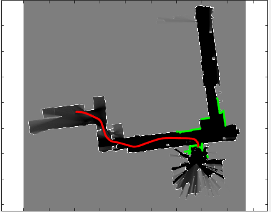

# Particle-filter-localization
Particle filter for pose tracking in 2D space

### objectives ###
To compute pose of a mobile robot given its sensor readings, parameters, and input map.

**Parameters** include  the map resolution (param.resol) as the number of cells per meter, map size (param.size) as the number of cells in the map, and origin of the robot (param.origin) as the starting cell coordinates of the robot in the map.

### How to use ###
* Clone the repository
* Run the **example_test.m** file to visualize the result.

### Result illustration ###

